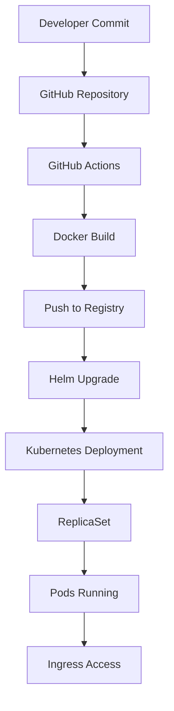

# Helm Charts

> **Prototype Notice:** This platform is currently in prototype status. Features and APIs may change between releases.

---

## Overview

The platform provides a curated Helm chart library at `https://charts.internal.example.com`. These charts encapsulate best-practice Kubernetes resource configurations for common microservice patterns, so teams can deploy without writing raw YAML.

---

## Adding the Chart Repository

```bash
helm repo add kdp https://charts.internal.example.com
helm repo update
```

---

## Available Charts

| Chart | Description |
|-------|-------------|
| `kdp/microservice` | Stateless HTTP/gRPC microservice (Deployment + Service + HPA) |
| `kdp/worker` | Background job worker (Deployment, no ingress) |
| `kdp/cronjob` | Scheduled batch job |
| `kdp/postgres` | PostgreSQL with automated backups |
| `kdp/redis` | Redis cache with Sentinel |

---

## Deploying the `microservice` Chart

```bash
helm install <release-name> kdp/microservice \
  --namespace <namespace> \
  --values values.yaml
```

## Helm Chart Deployment




## Upgrading a Release

```bash
helm upgrade <release-name> kdp/microservice \
  --namespace <namespace> \
  --values values.yaml \
  --set image.tag=1.3.0
```

---

## Listing and Inspecting Releases

```bash
helm list -n my-team-prod                   # list all releases in a namespace
helm status my-service -n my-team-prod      # status of a specific release
helm get values my-service -n my-team-prod  # view effective values
```

---

## Custom Charts

Teams can maintain their own charts alongside the platform charts. Store custom charts in your Git repository under a `charts/` directory and reference them locally:

```bash
helm install my-custom-service ./charts/my-custom-service \
  --namespace my-team-dev \
  --values ./charts/my-custom-service/values-dev.yaml
```

---

## Chart Versioning

Always pin chart versions in CI to avoid unexpected changes from upstream updates:

```bash
helm install my-service kdp/microservice --version 2.4.1 ...
```

Run `helm search repo kdp --versions` to see all available chart versions.

---

*Documentation version: 0.1.0 — May 2026*
*Maintained by the Platform Engineering team.*
