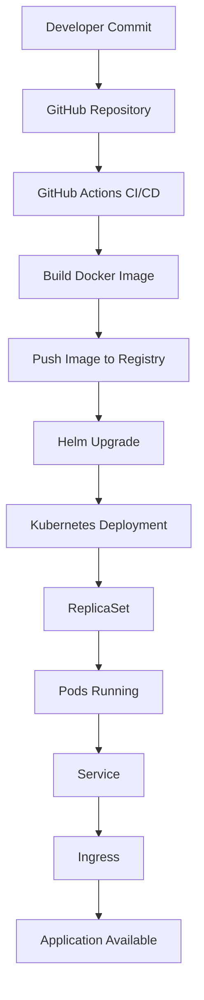

# Kubernet deployment platfrom docs

Enterprise-style Kubernetes deployment workflows using GitHub Actions, Helm, and GitOps practices.

## Features

- Quick Start Guide
- Cluster Provisioning
- Helm chart Deployment
- GitHub Actions CICD
- Auto Scaling
- Monitoring & Observability
- Rollbacks
- Secrets Management

## Architecture

